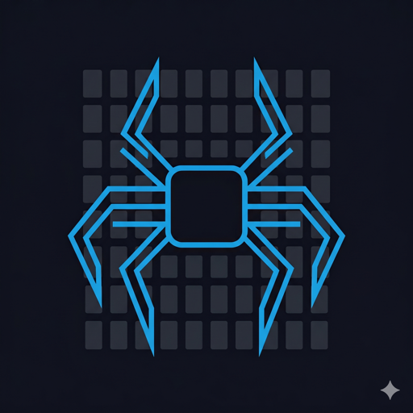

<p align="center">
  
</p>

<h1 align="center">AppCrawl</h1>

<p align="center"><b>AI-powered app testing.</b> Let an LLM explore your mobile or web app, find bugs, and generate replayable tests. Bring your own API key.</p>

[](https://www.npmjs.com/package/appcrawl)
[](./LICENSE)

---

## What it does

```bash
# Let AI explore your app autonomously
appcrawl explore --app com.example.app

# Or steer it with natural language
appcrawl run "sign up, verify email, reach dashboard"

# Extract explore sessions to replayable YAML suites
appcrawl extract --from appcrawl-reports/latest

# Run suites in CI with parallel execution
appcrawl suite tests/ --parallel 4 --notify-slack $SLACK_WEBHOOK
```

AppCrawl runs an LLM agent (Claude, GPT-4o, Gemini, Ollama, ...) against your iOS simulator, Android emulator, or a Playwright-driven browser. The agent sees screenshots + the accessibility tree, picks actions (tap, type, scroll, verify), and logs anything that looks wrong.

## Features

- **Mobile + web** — iOS via Maestro, Android via adb, web via Playwright
- **BYO LLM** — Claude / GPT-4o / Gemini / Ollama / OpenRouter
- **Explore mode** — autonomous bug-hunting with breadth-first screen coverage
- **Steered mode** — natural-language E2E tests, no selectors
- **Suite runner** — YAML-defined tests, parallel execution
- **Test extraction** — convert explore sessions to replayable suites
- **Visual regression** — pixel-diff screenshots against baselines
- **GitHub Action** — drop-in composite action with PR comments
- **Static HTML dashboard** — deploy reports to any static host
- **Slack + webhook notifications** — know the moment something breaks

## Install

```bash
npm install -g appcrawl
```

Requires **Node 20+**. For iOS testing also install [Maestro](https://maestro.mobile.dev/); for web testing run `npx playwright install chromium`.

## Quick start

1. Set your LLM key:
   ```bash
   export ANTHROPIC_API_KEY=sk-ant-...   # or OPENAI_API_KEY / GOOGLE_GENERATIVE_AI_API_KEY
   ```

2. Verify setup:
   ```bash
   appcrawl doctor
   ```

3. Explore:
   ```bash
   # iOS
   appcrawl explore --app com.example.app --max-steps 20

   # Web
   appcrawl explore --url https://example.com --platform web --max-steps 20
   ```

4. Open the generated HTML report from `appcrawl-reports/`.

## Pricing

- **Free** — 5 explore runs / day, console output, single LLM provider
- **Pro ($79/yr)** — unlimited runs, steered testing, HTML/JSON reports, visual regression, CI mode, Slack notifications, parallel suites

Buy at [appcrawl.dev](https://appcrawl.dev) · License key is offline-validated.

## Docs

- [Website](https://appcrawl.dev)
- [GitHub Action example](./examples/ci/appcrawl-web.yml)
- [Config reference](./examples/dogfood/README.md)

## License

MIT — see [LICENSE](./LICENSE).
